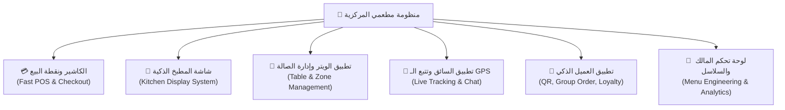
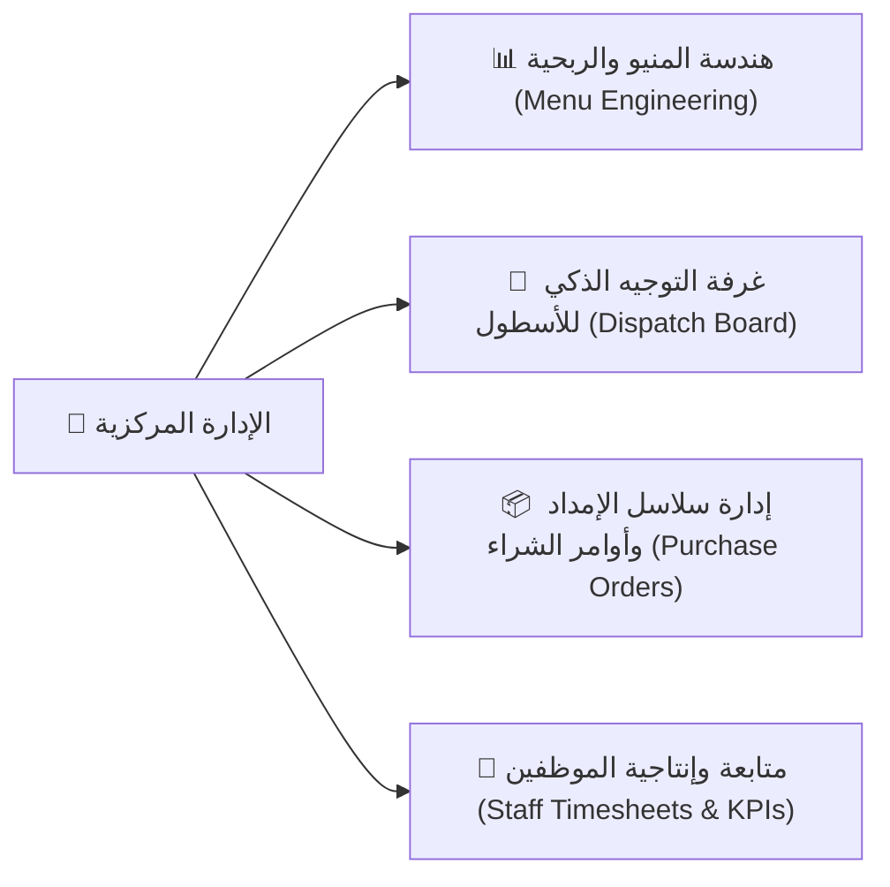

# 📊 تقرير الجدوى والقيمة التشغيلية والاستثمارية لنظام «مطعمي»
> **Enterprise Multi-Role Restaurant Management OS**
> **منظومة تشغيل وإدارة المطاعم وسلاسل الفرانشايز المتكاملة**

---

## 🧭 فهرس المحتويات
1. [الملخص التنفيذي والقيمة الجوهرية](#-1-الملخص-التنفيذي-والقيمة-الجوهرية)
2. [العائد المالي المباشر وتخفيض التكاليف (Financial ROI)](#-2-العائد-المالي-المباشر-وتخفيض-التكاليف-financial-roi)
3. [مكاسب صاحب المطعم المستقل (Single Branch Owner)](#-3-مكاسب-صاحب-المطعم-المستقل-single-branch-owner)
4. [مكاسب سلاسل المطاعم والفرانشايز (Chains & Franchises)](#-4-مكاسب-سلاسل-المطاعم-والفرانشايز-chains--franchises)
5. [تجربة العميل ومضاعفة الإيرادات (Customer Retention & Growth)](#-5-تجربة-العميل-ومضاعفة-الإيرادات-customer-retention--growth)
6. [مقارنة تفصيلية: الإدارة التقليدية vs منظومة «مطعمي»](#-6-مقارنة-تفصيلية-الإدارة-التقليدية-vs-منظومة-مطعمي)
7. [الجدارة والموثوقية التقنية (Enterprise Tech Stack)](#-7-الجدارة-والموثوقية-التقنية-enterprise-tech-stack)

---

## 🎯 1. الملخص التنفيذي والقيمة الجوهرية

تواجه المطاعم اليوم تحديات تشغيلية ومالية معقدة، أبرزها:
* **استنزاف الأرباح عبر عمولات تطبيقات التوصيل الوسيطة** التي تقتطع ما بين **18% إلى 25%** من كل طلب.
* **الهدر المالي وفقدان المكونات** الناتج عن غياب الربط الآلي بين المبيعات والمخزون.
* **بطء وتيرة إعداد وتجهيز الطلبات في أوقات الذروة** نتيجة الاعتماد على الأوراق والتواصل الصوتي العشوائي.
* **غياب الرؤية اللحظية للمالك** حول الأداء اليومي وصافي الربح الحقيقي لكل صنف.

مشروع **«مطعمي»** صُمم ليكون **نظام تشغيل مركزي (All-in-One Restaurant OS)** يربط كل أطراف المنظومة في تطبيق موحد متعدد الأدوار:
**(العميل، الويتر، الكاشير، شيف المطبخ KDS، سائق التوصيل، ومدير الفرع والمالك)**.



---

## 💰 2. العائد المالي المباشر وتخفيض التكاليف (Financial ROI)

| المحور المالي | الوضع التقليدي | الحل والتحسين في منظومة «مطعمي» | العائد المالي المباشر |
| :--- | :--- | :--- | :---: |
| **عمولات التوصيل** | دفع 18% - 25% لشركات التوصيل الوسيطة. | امتلاك قناة طلب وتوصيل مباشرة مع تتبع GPS وشات فوري. | **توفير 15% - 25%** من مبيعات التوصيل. |
| **الهدر وأخطاء التحضير** | أخطاء كتابية بالبونات أو تحضير أطباق خاطئة بالصالة. | شاشة مطبخ KDS فورية بتنبيهات صوتية وملاحظات مخصصة للمعدلات. | **تخفيض هدر المطبخ بنسبة 30%**. |
| **معدل دوران الطاولات** | بطء استلام الطلب وتأخر الحساب يقلل استيعاب الصالة. | طلب فوري عبر QR أو جهاز الويتر اللوحي وسرعة سداد الحساب. | **تسريع دوران الطاولات بنسبة 35%**. |
| **التسريب وسرقات الصندوق** | تلاعب بالطلبات الملغاة وفروقات في عهدة الكاشير. | إغلاق الورديات وسجلات الصندوق (X/Z Reports) مع سجل تدقيق أمني. | **منع التسريب المالي بنسبة 100%**. |

---

## 🏪 3. مكاسب صاحب المطعم المستقل (Single Branch Owner)

### 1️⃣ نقطة بيع كاشير سريعة ومرنة (Fast POS & Checkout)
* **واجهة تفاعلية فائقة السرعة:** صُممت لمعالجة الطلبات في ثوانٍ معدودة في أوقات الذروة.
* **خيارات دفع مرنة:** تدعم الدفع النقدي، الشبكة / البطاقات، وتقسيم الفواتير بين عدة أفراد.
* **فواتير ضريبية وحساب آلي للضريبة:** إصدار فواتير متوافقة مع متطلبات الضريبة وكوبونات الخصم بمرونة كاملة.

### 2️⃣ شاشة المطبخ الرقمية (Kitchen Display System - KDS)
* **إنهاء فوضى البونات الورقية:** توزيع الطلبات في أعمدة مصنفة (جديد / قيد التحضير / جاهز للتسليم).
* **إدارة الطهاة وتوزيع المهام (Multi-Chef Claim):** كل شيف يمكنه استلام الطلب المخصص له لمنع تكرار الطهي وضمان المسؤولية.
* **تنبيهات صوتية ولحظية:** إشعار صوتي فوري عند دخول أي طلب جديد للصالة أو التوصيل.

### 3️⃣ إدارة الصالة وحجوزات الطاولات (Table Management & Reservations)
* **خريطة الصالة والمناطق:** تنظيم الطاولات حسب المناطق (داخلي، خارجي، عائلات) ومراقبة حالتها المباشرة.
* **حجوزات مسبقة للزبائن:** تنظيم الحجوزات لتفادي الازدحام وتحسين استغلال المقاعد.
* **إكراميات الويتر (Waiter Tips):** نظام لمتابعة الإكراميات والمكافآت لتحفيز فريق الخدمة على تقديم أفضل تجربة.

### 4️⃣ موجز المالك اليومي (Owner Daily Digest)
* متابعة المبيعات اليومية، صافي الأرباح، متوسط زمن إعداد الوجبات، والأصناف الأكثر مبيعاً أينما كنت دون الحاجة للتواجد طوال اليوم في المطعم.

### 5️⃣ الحماية من انقطاع الإنترنت (Offline-First Resiliency)
* حتى لو انقطعت شبكة الإنترنت داخل المطعم، يستمر الكاشير والويتر في تسجيل الطلبات وحفظها محلياً في قاعدة بيانات **Hive**، مع حماية العمليات بمفاتيح **Idempotency Keys** لمنع تكرار العمليات عند عودة الشبكة.

---

## 🏢 4. مكاسب سلاسل المطاعم والفرانشايز (Chains & Franchises)



### 1️⃣ هندسة المنيو وتحليل الربحية (Menu Engineering Matrix)
تطبيق مصفوفة بوسطن الربحية لتقسيم أطباق المنيو إلى 4 تصنيفات واضحة:
* ⭐ **النجوم (Stars):** أصناف عالية الربحية وعالية الشعبية (التركيز التسويقي عليها).
* 🐎 **أبقار النقد (Plowhorses):** أصناف عالية الشعبية ومنخفضة الهامش الربحي (إعادة تسعيرها أو تحسين تكلفة مكوناتها).
* 🧩 **الألغاز (Puzzles):** أصناف عالية الربحية ولكن قليلة الطلب (تحسين موضعها بالمنيو وعمل عروض ترويجية لها).
* 🐕 **الأصناف الخاسرة (Dogs):** أصناف قليلة الطلب ومنخفضة الربح (حذفها لتوفير الهدر والمخزون).

### 2️⃣ غرفة التوجيه والتوزيع الذكي للأسطول (Smart Dispatch Board)
* لوحة تحكم مركزية لإدارة أسطول السائقين بين كافة الفروع.
* **خوارزمية التوزيع الذكي (Weighted Driver Scoring):** ترشيح السائق الأفضل آلياً بناءً على المسافة، تقييم الأداء، وحجم حمولة الطلبات الحالية، مع إعادة المحاولة التلقائية كل 30 ثانية.

### 3️⃣ إدارة المخزون وأوامر الشراء المركزية (Inventory & Purchase Orders)
* تنبيهات فورية للنواقص عند وصول أي صنف أو مادة خام لحد إعادة الطلب.
* إصدار أوامر الشراء واعتماد الفواتير الواردة من الموردين لضبط تكلفة الأغذية (Food Cost) بدقة متناهية.

### 4️⃣ إدارة وتقييم أداء الطاقم والورديات (Staff KPIs & Timesheet)
* تسجيل الحضور والانصراف (Clock-In / Clock-Out) رقمياً.
* تقييم دقيق لأداء كل موظف: (سرعة تحضير الشيف، مبيعات الكاشير، تقييمات الويتر).

---

## 📱 5. تجربة العميل ومضاعفة الإيرادات (Customer Retention & Growth)

```
┌────────────────────────────────────────────────────────────────────────┐
│                   🌟 تجربة العميل في تطبيق "مطعمي"                    │
├────────────────────────────────────────────────────────────────────────┤
│ 1. منيو تفاعلي ذكي: فلترة مسببات الحساسية + السعرات الحرارية          │
│ 2. خاصية الغرف الجماعية (Group Ordering): مشاركة السلة مع الأصدقاء     │
│ 3. برنامج ولاء ومكافآت (Loyalty Points): استبدال النقاط بوجبات مجانية  │
│ 4. بطاقات الهدايا (Gift Cards): إهداء الأصدقاء رصيد وجبات             │
│ 5. تتبع حي للطلب بالـ GPS + شات فوري ومباشر مع السائق                  │
└────────────────────────────────────────────────────────────────────────┘
```

1. **الطلب الجماعي (Group Order Room):** إمكانية تجمع الأصدقاء أو زملاء العمل في سلة طلب واحدة عبر كود مشاركة، مما يضاعف متوسط قيمة الفاتورة (AOV).
2. **بطاقات الهدايا (Gift Cards Hub):** بيع رصيد وجبات مسبقة الدفع للإهداءات، مما يمنح المطعم سيولة نقدية مقدمة (Cash in Advance).
3. **برنامج الولاء والنقاط (Loyalty Program):** جمع النقاط واستبدالها بمكافآت، مما يعزز ولاء العميل وعودته المستمرة.
4. **تتبع مباشر للسائق وشات لحظي:** طمأنة العميل بمشاهدة مندوب التوصيل على الخريطة والتواصل معه كتابياً داخل التطبيق.

---

## ⚖️ 6. مقارنة تفصيلية: الإدارة التقليدية vs منظومة «مطعمي»

| وجه المقارنة | المطعم التقليدي | مطعم يعمل بنظام «مطعمي» |
| :--- | :--- | :--- |
| **استقبال الطلبات** | كتابة يدوية بالورقة وتأخير في تسليم البون للمطبخ. | إرسال فوري من جهاز الويتر أو مسح كود QR في **أقل من ثانية واحدة**. |
| **خدمة التوصيل** | الاعتماد على تطبيقات وسيطة تقتطع 20% وتخفي بيانات العملاء. | **قناة توصيل مباشرة للمطعم**، مع تتبع GPS كامل وامتلاك كامل لبيانات العملاء. |
| **إدارة المخزون** | جرد شهري يدوي متأخر واكتشاف النواقص بعد نفادها. | **جرد لحظي آلي متصل بنقطة البيع** مع تنبيهات مسبقة وأوامر شراء مؤتمتة. |
| **التقارير وصنع القرار** | فواتير ورقية متناثرة وصعوبة معرفة الأرباح بدقة. | **مصفوفة هندسة منيو فورية + موجز مالي يومي للمالك** بضغطة زر. |
| **انقطاع الإنترنت** | توقف حركة البيع وإرباك كامل في الصالة. | **استمرارية كاملة بدون إنترنت (Offline-First)** مع مزامنة تلقائية فور عودته. |

---

## 🛠️ 7. الجدارة والموثوقية التقنية (Enterprise Tech Stack)

* **بنية برمجية معمارية نظيفة (Clean Architecture):** تسهل تخصيص الهوية والشعار وإضافة ميزات جديدة بدون المساس باستقرار النظام.
* **أمان وقواعد بيانات متقدمة:** مبني على **PostgreSQL / Supabase** مع حماية صارمة على مستوى الصفوف (**Row Level Security - RLS**).
* **اختبارات جودة وضمان أداء عالية:** النظام مدعوم بأكثر من **24,200 سطر اختبارات برمجية مؤتمتة (Unit & Widget Tests)** خالية تماماً من أي أخطاء تحليلية (0 Analyzer Issues).

---

> [!TIP]
> **الخلاصة:** نظام **«مطعمي»** ليس مجرد تطبيق واجهات، بل هو **استثمار تشغيلي شامل** يخفض التكاليف التشغيلية، يقضي على العمولات والهدر، ويرفع مبيعات المطعم وأرباحه الصافية من اليوم الأول.
