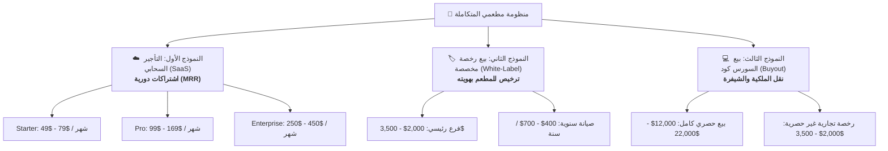
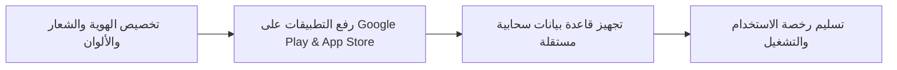
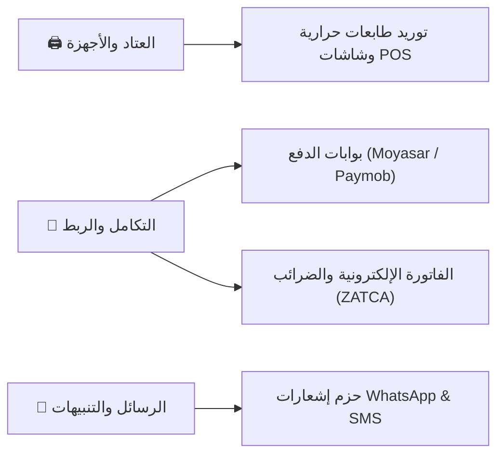
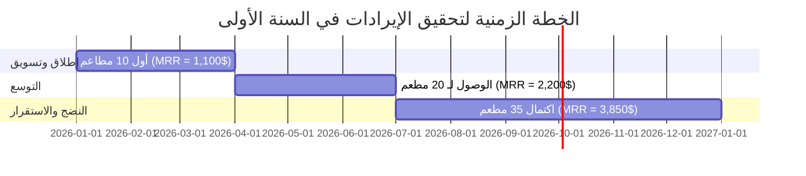

# 💎 دليل التسعير والتقييم التجاري لنظام «مطعمي»
> **Enterprise Multi-Role Restaurant Management System**
> نظام متكامل يشمل: نقطة بيع الويتر (POS)، شاشة المطبخ (KDS)، تطبيق العميل، تطبيق السائق، ولوحة تحكم المدير والتوزيع الذكي.

---

## 🧭 خارطة نماذج العمل والاستثمار

---

## 🛠️ 1. التقييم الفني ومواصفات النظام

> [!IMPORTANT]
> السيستم ليس مجرد تطبيق واجهات بسيط، بل **منظومة تشغيل فعلية جاهزة للإنتاج** مبنية بأسلوب **Clean Architecture** تم فحصها بأكثر من 24,000 سطر اختبارات برمجية.

### 📐 مؤشرات حجم الكود الفعلي:
* **حجم الكود المصدري:** أكثر من **37,200 سطر كود نقي** (Dart / Flutter).
* **حجم الاختبارات وضمان الجودة:** أكثر من **24,240 سطر اختبارات** (Unit & Widget Tests).
* **تغطية الشاشات:** **37 صفحة وشاشة كاملة** مجربة ومعتمدة بالكامل (0 Analyzer Issues).
* **قواعد البيانات:** **19 جدولاً** في Supabase PostgreSQL محمية بنظام **Row Level Security (RLS)** مع محرك مزامنة لحظية (Realtime).
* **دعم العمل بدون إنترنت (Offline-First):** طابور إرسال الطلبات عبر **Hive** مع **Idempotency Keys** لحماية المدفوعات والطلبات من التكرار.

---

## ☁️ 2. النموذج الأول: التأجير السحابي والاشتراكات الشهرية (SaaS)

> [!TIP]
> **الخيار الأفضل لبناء ثروة ودخل شهري متكرر (MRR).** 
> 30 عميلاً فقط يوفرون تدفقاً نقدياً مستقراً يفوق **3,000$ شهرياً** بشكل مستمر.

### 💳 جدول باقات الاشتراك الشهري:

| الباقة | المواصفات والميزات | السعر بالريال السعودي | السعر بالجنيه المصري | السعر بالدولار (USD) |
| :--- | :--- | :---: | :---: | :---: |
| **باقة Starter** | كاشير وويتر + شاشة مطبخ KDS + منيو QR للصالة (فرع واحد) | **180 – 300 ريال / شهر** | **2,500 – 4,000 جنيه / شهر** | **$49 – $79 / شهر** |
| **باقة Pro**   *(الأكثر طلباً)* | كل ميزات Starter + تطبيق السائقين مع تتبع GPS حي + شات مباشر + نقاط ولاء وكوبونات وحجز طاولات | **370 – 630 ريال / شهر** | **5,000 – 8,500 جنيه / شهر** | **$99 – $169 / شهر** |
| **باقة Enterprise** | إدارة متعددة الفروع (Multi-Branch) + تحليلات مبيعات مركزية + دعم فني مخصص 24/7 | **950 – 1,700 ريال / شهر**   *(لأول 3 فروع)* | **12,000 – 22,000 جنيه / شهر**   *(لأول 3 فروع)* | **$250 – $450 / شهر**   *(لأول 3 فروع)* |

> [!NOTE]
> **رسوم الإعداد والتشغيل لمرة واحدة (Setup Fee):**
> يتم تحصيل **100$ – 250$** (ما يعادل 400 – 1,000 ريال | 5,000 – 12,000 جنيه) لإدخال المنيو، خريطة الطاولات، وتدريب العاملين.

---

## 🏷️ 3. النموذج الثاني: بيع نسخة مخصصة للعلامة التجارية (White-Label License)

> [!NOTE]
> المطعم يحصل على التطبيقات باسمه وشعاره على **Google Play** و **App Store** مع قاعدة بيانات مستقلة، **دون منحه السورس كود البرمجي**.

### 💰 تسعير الرخص والتخصيص:

| البند | السوق الخليجي (SAR) | السوق المصري (EGP) | السوق العالمي (USD) |
| :--- | :---: | :---: | :---: |
| **ترخيص الفرع الأول** | **7,500 – 13,000 ريال** | **60,000 – 100,000 جنيه** | **$2,000 – $3,500** |
| **إضافة فرع جديد لنفس العميل** | **1,100 – 1,900 ريال** | **12,000 – 20,000 جنيه** | **$300 – $500** |
| **عقد الصيانة السنوي (AMC)** | **1,500 – 2,600 ريال / سنة** | **15,000 – 25,000 جنيه / سنة** | **$400 – $700 / سنة** |

---

## 💻 4. النموذج الثالث: بيع السورس كود بالكامل وحقوق الملكية (Buyout)

> [!WARNING]
> تكلفة بناء نظام بهذا الحجم مع فريق برمجي كامل (Senior Flutter + Senior Backend + QA + UI/UX) لمدة 5 أشهر تتراوح بين **18,000$ إلى 30,000$**.

### 1️⃣ بيع حصري كامل وتنازل عن الملكية (Exclusive IP Buyout):
* **المفهوم:** المشتري يمتلك الكود بالكامل بنسبة 100%، وتلتزم بعدم بيع الكود لأي جهة أخرى.
* **السعر المقترح عالمياً والخليج:** **$12,000 – $22,000** (45,000 – 82,000 ريال سعودي).
* **السعر المقترح داخل مصر:** **$6,000 – $10,000** (300,000 – 500,000 جنيه مصري).

### 2️⃣ بيع ترخيص تجاري غير حصري (Non-Exclusive Source Code License):
* **المفهوم:** بيع نسخة من الكود لشركات البرمجيات والمطورين لاستخدامها في مشاريع عملائهم، مع احتفاظك بحق بيع الكود لآخرين.
* **السعر المقترح للرخصة الواحدة:** **$2,000 – $3,500** (7,500 – 13,000 ريال | 60,000 – 100,000 جنيه).

---

## 🔌 5. خدمات القيمة المضافة والإيرادات المساندة

1. **توريد العتاد والـ Hardware:** طابعات حرارية (Bluetooth/LAN) + شاشات مطبخ لمس (هامش ربح 20% - 30%).
2. **الربط مع بوابات الدفع الإلكتروني:** تكلفة ربط مخصصة **$200 – $500**.
3. **الربط مع الفاتورة الإلكترونية والضرائب:** تكلفة ربط **$400 – $800**.
4. **باقات رسائل الواتساب:** إرسال تحديثات حالة الطلب عبر واتساب باشتراك إضافي **$15 – $30 شهرياً**.

---

## 📈 6. دراسة الجدوى المالية التقديرية (السنة الأولى)

> [!TIP]
> **محاكاة واقعية لنموذج الاشتراكات الشهرية (SaaS) باستهداف 35 مطعماً فقط خلال 12 شهراً:**

* **رسوم الإعداد لأول مرة:** 35 مطعم × 150$ = **5,250$**
* **الإيراد الشهري المتكرر (MRR) عند اكتمال الهدف:** 35 مطعم × 110$ = **3,850$ شهرياً**
* **إجمالي إيرادات السنة الأولى:** **~ 35,000$ إلى 45,000$**
* **تكاليف السيرفرات والخدمات السحابية:** **~ 1,500$ إلى 2,500$ / سنوياً**
* **صافي الأرباح السنوية:** **~ 33,000$ إلى 42,500$ (هامش ربح يفوق 90%)**

---

## 🎯 7. الحجج البيعية لإقناع أصحاب المطاعم

1. **توفير عمولات تطبيقات التوصيل الخيالية (18% - 25%):**
   النظام يمنح المطعم قناته المباشرة بدون أي نسبة اقتطاع، ما يوفر آلاف الدولارات شهرياً.
2. **تسريع دورة المطبخ بنسبة 35%:**
   تلاشي الطلبات الورقية والتنبيه الصوتي الفوري في الـ KDS يقضي على أخطاء الطلبات.
3. **حماية المبيعات والمخزون:**
   سجل تدقيق كامل (`order_status_log`) يراقب كل حركة ويمنع التلاعب والسرقات.
